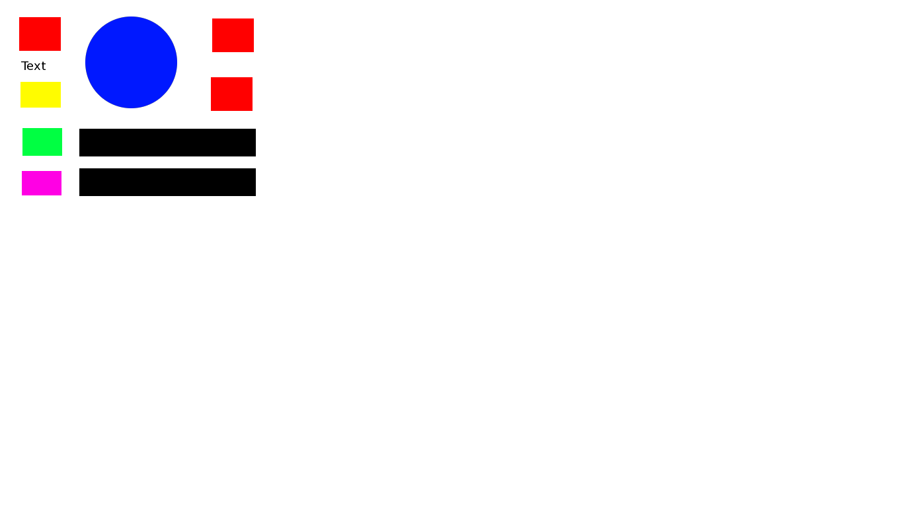
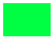

This is a brief tutorial on how to use the image logging utility that
comes with the package. The image logging is more useful in debugging
and monitoring than the regular logging which is provided for your use as
well. Learning by examples should be our approach. Therefore, the entire
tutorial consists of several examples from a few basic backends. All you
need is a quick look at them to understand the image logging.


**EXAMPLE 1 – Template matching of a blue circle**

After using the image logging configuration

```
GlobalConfig.image_logging_level = logging.INFO
GlobalConfig.image_logging_destination = “/tmp/imglogs”
```

and running a unit test about finding a blue circle with something like

```
$ python tests/test_region_control.py RegionTest.test_hover
```

we see the following sequence of images appear in the */tmp/imglogs*
directory:

1. *imglog001-1needle-shape_blue_circle.match*:

    This contains the configuration used for the match case in a plain text
    format depending on the backend used (here template matching).

2. *imglog001-1needle-shape_blue_circle.png*:

    

    Here is how to read the name:

    **imglog001** – step number (3 digit length by default) – one for each
    image matching case performed during the logging

    **1needle** – each step logs the needle (searched image), the haystack
    (image where search is done), and the hotmap (result from matching, i.e.
    “where it is warmer and colder when searching the image”)

    **shape_blue_circle.png** – file name used for the needle

3. *imglog001-2haystack-noname.png*:

    

    Here is how to read the name:

    **imglog001** – step number is the same, this is the haystack for this
    match case (first during logging)

    **2haystack** – don't mind the numbers, they are only to make the order
    more intuitive, first you see the needle to know what is searched for,
    then the haystack to know what the situation is, and finally you can go
    deeper in the debugging process if there are still questions

    **noname.png** – file name used for the haystack (or noname if a
    screenshot was made)

4. *imglog001-3hotmap-0.0.png*:

    

    Any found matches will be boxed here - currently identical to the
    haystack since zero matches were found.

    Name is read in a similar way like the next file.

5. *imglog001-3hotmap-1template-0.0.png*:

    

    Here is how to read the name:

    **imglog001**, **3hotmap** – should be clear by now

    **1template** – backend used is template matching, 1 stays because this
    is the first and only match (this dumped file is specific to the template
    matching and will generally not be found if you use different backend)

    **0.0** – this is the similarity – quite bad – check the
    haystack to see why

The first step is far from finding any match because of the blank haystack.
But the second matching attempt we try is far better:

*imglog002-2haystack-noname.png*:



And the hotmap for the template matching becomes

*imglog002-3hotmap-0.999999821186.png*:


with details as

*imglog002-3hotmap-1template-0.999999821186.png*:


This is ~1.0 match. Besides a greyscale hotmap of the similarity across
the entire haystack, the location of the maximum is circled to make it
easier to spot. Believe me, it seems easy here but some template hotmaps
could be quite hairy so this is definitely useful.


**EXAMPLE 2 – Template matching of multiple objects (`find_all`)**

Running the `find_all` unit test like

```
$ python tests/test_region_expect.py RegionTest.test_find_all
```

makes several matching steps one of which with a green and another with a
red box.

*imglog003-1needle-shape_green_box.png*:



*imglog004-1needle-shape_red_box.png*:


The resulting hotmaps for the red box template matching are now several,
one for each match made:

*imglog003-3hotmap-1template-1.0.png*:


*imglog003-3hotmap-2template-1.0.png*:


*imglog003-3hotmap-3template-0.999999403954.png*:


Observations? The hotmaps for all matches are arranged in a decreasing
order of similarity. Also there is a gradation of the circled areas
helping to locate the new match and to understand the order of visiting
the matches. All circled matches are acceptable, i.e. they are with
sufficient similarity. If there are 0 matches to satisfy some similarity
there is still at least one hotmap from the `find_all` with the best
unacceptable match (like the first hotmap from example 1).

Decreasing the similarity will lead to more acceptable matches and
therefore more template hotmaps with each match dumped separately.
This is always reflected in the way it is circled since its radius is
proportional to its similarity.


**EXAMPLE 3 – Feature matching of viewport transformed object**

Running

```
$ python tests/test_finder.py FinderTest.test_feature_viewport
```

will produce

*imglog005-1needle-n_ibs.png*:


*imglog005-2haystack-h_ibs_viewport.png*:


*imglog005-3hotmap-0.508287292818.png*


Here the box where the target is found is skewed according to the target's
orientation. The feature hotmaps look quite different but are not any more
difficult to understand:

*imglog0001-3hotmap-1detect.png*:


*imglog0001-3hotmap-2match.png*:


*imglog0001-3hotmap-3project.png*:


Here

1. red dots are detected features
2. yellow dots are matched features
3. green dots are verified features
4. blue dots are projected points

where 1) and 2) are visible only from DEBUG, 3) is visible from INFO
logging level, and 4) from WARN logging level. Some important details:

1. in some cases it is possible that no features are detected (e.g. If
the needle is very small) – you can easily recognize them from the fact
that the reported similarity will be 0 which is practically impossible
and (of course also no red dots are detected and hence drawn in DEBUG mode)

2. usually this is the least important marker

3. verification happens through RANSAC and other methods – in a few
words these features would meet the projection requirements (valid
object transformation)

4. a clicking point, a corner point or some other point that is
important to the searching


**MORE EXAMPLES – More advanced matching**

The same principle is followed by any more elaborate method than
the ones above. The needle (with match settings), haystack and
hotmap are always included where the needle may not necessarily
be image and depends on the target type and therefore backend.
If the method contains multiple stages, under sufficiently low
logging level it will also include additional hotmaps ordered
according to these stages. Multiple matches will be ordered in
direction of descending similarity with the best matches in the
beginning and only acceptable matches to be included. If the
backend does not support or report any similarity, the one
reported in the main hotmap will be set to zero.

As some examples, the mixed template-feature finder will dump
two extra hotmaps per match: one for the first template stage with
its attained similarity and one for the second feature stage with
its attained similarity. The text finder will dump extra hotmaps
for the test detection and OCR stages in a similar fashion. The
cascade and deep finder will have a needle which corresponds to
a trained cascade or neural network model.

Image logged dumps are also available in case the matching fails.
In the case of template matching, a single unacceptable (but best
available) match will be shown. All details about why the match
case failed are usually included in the same form as above. When
you are interested in the image logging of any particular backend,
you can just run a single match case and observe the dumps. If you
still need more info, you can also check the implementation of the
particular backend.

Ok, this is enough. I hope this helps you always keep an eye on what
is searched and found and makes your own developing easier.
